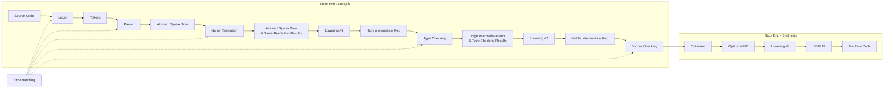

# Compiler Architecture
Broadly, the compiler's architecture can be described as such: 

```mermaid
flowchart LR
    subgraph FrontEnd[Front End - Analysis]
        A[Source Code] --> B[Lexer]
        B --> C[Tokens]
        C --> D[Parser]
        D --> E[Abstract Syntax Tree]
        E --> F[Name Resolution]
        F --> G[Abstract Syntax Tree<br>& Name Resolution Results]
        G --> H[Lowering #1]
        H --> I[High Intermediate Rep]
        I --> J[Type Checking]
        J --> K[High Intermediate Rep<br>& Type Checking Results]
        K --> L[Lowering #2]
        L --> M[Middle Intermediate Rep]
        M --> N[Borrow Checking]
    end

    subgraph BackEnd[Back End - Synthesis]
        N --> O[Optimizer]
        O --> P[Optimized IR]
        P --> Q[Lowering #3]
        Q --> R[LLVM IR]
        R --> S[Machine Code]
    end
    
    EH[Error Handling] -.-> B
    EH -.-> D
    EH -.-> F
    EH -.-> J
    EH -.-> N
```
