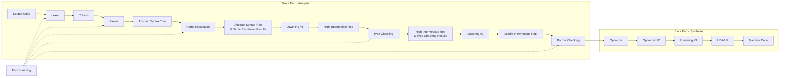
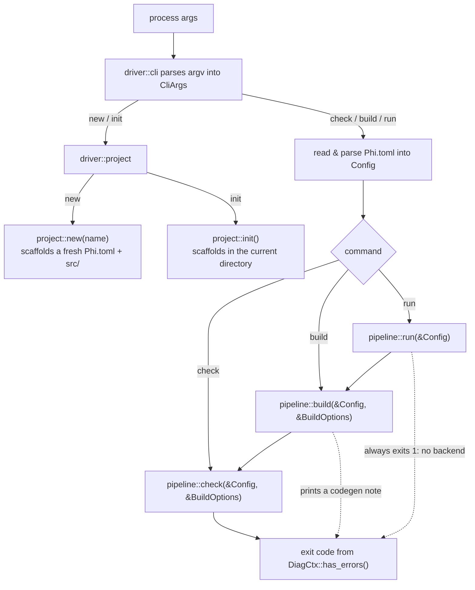
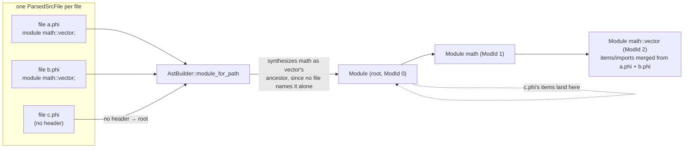
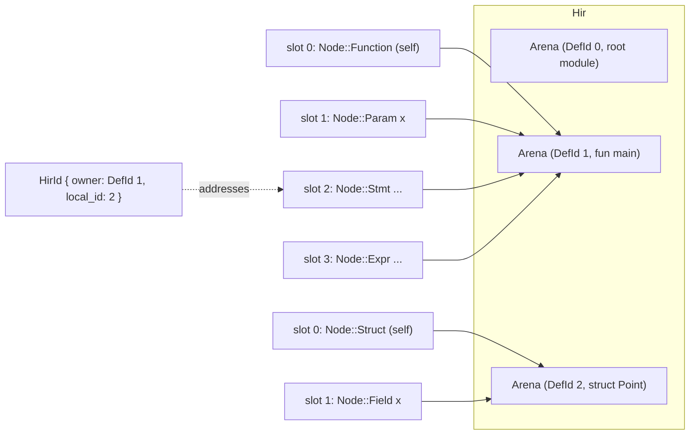
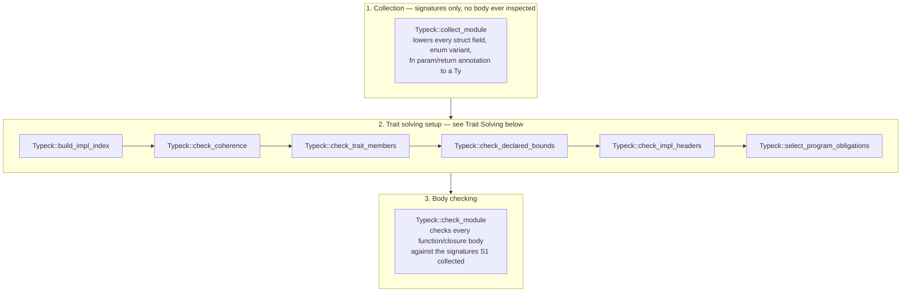
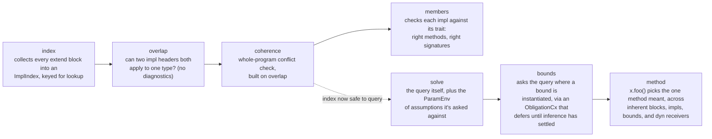

# Compiler Architecture
Broadly, the compiler's architecture can be described as such, which is similar to `rustc`: 


In the future, there are plans to move to incremental compilation, as well as to parallelize the lexer, parser, and codegen.

## Driver and CLI
Phi supports the following CLI:
```
phi build --ast --hir --mir --llvm --emit-debug --no-emit-core
phi check --ast --hir --mir --llvm --emit-debug --no-emit-core
phi run
phi new project-name
phi init
phi --help
```

Every project is described by a `Phi.toml` manifest at its root, with sources collected only
from that project's `src/` directory. The manifest has a required `[project]` table with
`name`, `version`, and `edition`, and an optional `[profile]` table with `mode = "debug" |
"release"`, defaulting to `debug` when the table (or the key) is absent.

```toml
[project]
name = "example"
version = "0.1.0"
edition = "2026"

[profile]
mode = "debug"
```

The overall driver architecture is the following:
```
driver/
├── cli.rs                 # CLI and Phi.toml parsing, and dispatch
├── source.rs              # SrcSpan, SrcFile, SrcMap, SrcCollector
├── project.rs             # Project creation: `phi new` and `phi init`
├── pipeline.rs            # The compiler stages (lexer -> parser -> ...)
└── emit_debug.rs          # Human-readable dumps of each stage's output
```

The CLI and Phi.toml parsing are implemented by the `driver::cli` module. The code inside `driver::cli` collects the args given into two constructs:
1. `CliArgs`, an enum which contains all possible commands and tracks what options were given for the current command.
2. `Config`, a struct read from the project's `Phi.toml`, holding project name/version/edition, the compilation mode (release/debug), and the project's root and `src/` directories.
Based on what args are given, `driver::cli` either dispatches to the `driver::project` module, which handles project creation, or to the `driver::pipeline` module, which handles the actual compilation.



`build` and `run` are thin wrappers around `check`, not separate pipelines: `build` calls `check`
and, only if it reported no errors, prints a note about code generation; `run` calls `build` and
then unconditionally reports that there's no backend to run. This is why `check` is the only
place in `pipeline.rs` that lexes, parses, lowers, resolves, and type-checks — the other two
commands exist to describe what a real toolchain's `build`/`run` would additionally do once
codegen lands.

The public API in `driver::project` and `driver::pipeline` mirrors the CLI. In `project.rs`, there is `pub fn init()` and `pub fn new(project_name: &str)`, which mirror the two commands in the CLI with the same name. In `pipeline.rs`, there is `pub fn check(config: &Config, options: &BuildOptions)`, `pub fn build(config: &Config, options: &BuildOptions)`, and `pub fn run(config: &Config)`. `Config` and `BuildOptions` are kept as separate arguments rather than merged into one struct: `Config` carries the manifest -- what project this is -- while `BuildOptions` carries the flags given to the specific `build` or `check` invocation, and those two things vary independently.

`build` and `check` accept the same flags and differ only in that `build` additionally prints a note that code generation is not implemented yet and that `build` currently only checks; `run` builds first, then reports that there is no backend to run and exits with status 1. `--mir` and `--llvm` are both accepted by `build` and `check`, but since neither stage exists yet, passing either just prints a note that the stage is not implemented and has no other effect. `--emit-debug` dumps every stage that is actually implemented, which includes the `NameResolutions` and `TypeResolutions` dumps even though those have no flag of their own to request them individually; `--no-emit-core` never affects compilation itself, only whether the core library's definitions show up in those dumps.

The remaining module, `driver::source`, contains `SrcSpan`, `SrcFile`, `SrcMap`, and `SrcCollector`, which are used to track source files and source file contents, and to collect them from the project's `src/` directory.

`SrcSpan` represents a half-open span of character offsets in the source code. It is a pure data class and does essentially nothing else but hold these two indices. These offsets are global across all source files which removes the requirement to store a pointer/reference to the file inside `SrcSpan`. Meanwhile, `SrcFile` tracks the contents of a single file and some metadata about it. This is essentially the structure of `SrcFile`.

```rust
pub struct SrcFile {
    pub name: String,
    pub content: Vec<char>,
    /// Whether the file is a part of lib/core (which holds implementations of the core of the stl) or a user file
    pub origin: FileOrigin,
    /// The offset of this file's first char within the whole `SrcMap`'s global address space.
    pub global_offset: usize,
    /// The global offset at which each line of this file starts.
    pub line_starts: Vec<usize>,
}
```

Meanwhile, `SrcMap` keeps track of all `SrcFile`s in the project and allows us to query some information about the contents of each file. See the code implementation for what queries we can make. Files are added into `SrcMap` through the `SrcCollector` class which walks through the current repository searching for `.phi` files. 

## Lexer
The first stage in the pipeline is lexing, which converts the raw text of a `SrcFile` into `Token`s. The `Lexer` works on UTF-8 source code, which is decoded into chars. The structure of the `lexer` module is the following:
```
src/
├── lexer.rs                 # Handles CLI parsing (clap/structopt)
└── lexer/
    └── token.rs            # The actual compiler stages (lexer -> parser -> ...)
```
`token.rs` holds the `Token` struct which comprises of two things: a `TokenKind` enum storing the type of token it is and a `SrcSpan` storing the token's location.

```rust
pub struct Token {
    pub kind: TokenKind,
    pub span: SrcSpan,
}
```

`lexer.rs` holds the actual implementation for the `Lexer`. The `Lexer` is a lightweight struct which operates over reference to the contents of a file. It exposes two functions as a part of its public-facing interface: `new` (which creates a new `Lexer` for a file) and `tokenize` (which lexes the file to produce a `Token` stream). Since one instance of `Lexer` only operates for one file, a new instance must be created for each file.

```rust
pub struct Lexer<'a> {
    /// [`Lexer::src`] is a &Vec<char> represent the raw source code.
    src: &'a Vec<char>,

    /// [`Lexer::file_offset`] allows the [`Lexer`] to produce global
    /// [`SrcSpan`]s for the [`Token`] stream it outputs.
    file_offset: usize,

    /// [`Lexer::cursor`] is the current position in [`Lexer::src`].
    cursor: usize,

    /// [`Lexer::lexeme_pos`] is position that the current lexeme (lexical unit)
    /// starts at in [`Lexer::src`].
    /// This is required for generating spans for multi-character tokens as
    /// [`Lexer::cursor`] is not the start of the token anymore.
    lexeme_pos: usize,
}

/// Public facing methods
pub fn new(src_text: &'a Vec<char>, file_offset: usize) -> Lexer<'a>;
pub fn tokenize(&mut self) -> Vec<Token>;
```

## Parser
The Phi parser is implemented with the `chumsky` parser combinator library. `Parser` is a lightweight struct. It stores nothing about the file which is being parsed. To parse a file, `Parser` exposes the following method:

```rust
pub fn parse(&self, tokens: &[Token], file_offset: usize) -> ParsedSrcFile;
```

Since Phi's semantics allow a module to be implemented across several files, we cannot return an AST from just one file. Instead, the `parse` functions returns a `ParsedSrcFile`, which must be combined based on what module each implements to create the Abstract Syntax Tree (AST). The `Parser` has just the function for this, which parses all token streams into the AST:
```rust
pub fn parse_all(&self, streams: &[(Vec<Token>, usize)]) -> Ast {
```

The structure of the parser module and its submodules is as follows:
```src/
└── parser.rs
    ├── block_parser.rs
    ├── expr_parser.rs
    ├── item_parser.rs
    ├── pattern_parser.rs
    └── type_parser.rs
```
Each submodule produces a specific sub-grammar for group of language features. There is a sub-grammar for blocks/statements, for expressions, for patterns, etc. which can be used. However, this is slightly misleading as to what goes on under the hood. Since sub-grammars recurse into each other, the  library requires that we define "monolithic" grammars which is responsible for parsing all recursing sub-grammars. For example, types and expressions recurse into each other, requiring a single grammar for all expressions and types. We thus separate these grammars for a cleaner public-facing interface.

## Abstract Syntax Tree (AST)
The Abstract Syntax Tree is a tree representing the written program. The goal of the AST is convert the user's exact syntax into a tree form for semantic analysis. Nodes in the AST are heap-allocated, unlike the HIR later on. However, despite not being arena-allocated, nodes in the AST are still allocated a `NodeId` for identifcation during name resolution.

### Items
An `Item` represents any top-level declaration or statement. The following describes exactly what an `Item` can be.
```rust
#[derive(Clone, Debug)]
pub struct Item {
    pub kind: ItemKind,
    pub span: SrcSpan,
}

#[derive(Clone, Debug)]
pub enum ItemKind {
    ModuleDecl(ModuleDecl),
    Import(Import),
    Function(Function),
    Struct(Struct),
    Enum(Enum),
    Trait(Trait),
    Extend(Extend),
    Error,
}
```
An important thing to note is that `ModuleDecl` only represents the module declaration at the top of a file, such as `module math::vector`. That is, it just stores information not what module this file is implementing, **not** the contents of that module. This is due to Phi semantics allowing modules to implement any separate module. When the AST is created, code is organized into `Module`s, which actually hold information about the `Items` and imports in a module. Each module is assigned an `ModId` (which is just a unique integer) to help with this process.

`Parser::parse` (and `parse_all`, its whole-build counterpart) each produce one `ParsedSrcFile` per file, which describes a file's own `module` header, its imports, and its items. `Ast::new` then turns a `Vec<ParsedSrcFile>` into the module tree, via a private `AstBuilder`:



### Types
To separate related work into distinct stages of the pipeline when possible, `ast::Ty` deliberately does not distinguish between primitives and nominal types to prevent name resolution from being done during parsing. Thus, there is one representation with `TyKind::Path`.

```rust
#[derive(Clone, Debug)]
pub struct Ty {
    pub kind: TyKind,
    pub span: SrcSpan,
}

#[derive(Clone, Debug)]
pub enum TyKind {
    Path {
        path: Path,
        args: Vec<Ty>,
    },
    Ref {
        base: Box<Ty>,
        mutability: Mutability,
    },
    /// `any T`, which can only be used as a parameter or return type.
    Any(Box<Ty>),
    Tuple(Vec<Ty>),
    Array {
        elem: Box<Ty>,
        len: Option<Box<Expr>>,
    },
    Function {
        params: Vec<Ty>,
        ret: Option<Box<Ty>>,
    },
    SelfType,
    Dyn {
        path: Path,
        args: Vec<Ty>,
    },
    Error,
}
```

## Name Resolution
Name Resolution operates on the AST to produce a side table mapping `Path`s in the AST to references to Nodes in the AST. Since paths cannot uniquely identify variables (such as in the case of variable shadowing), we identify using each node's `NodeId` and append a list of two tuples where the first element is a Path owned by the node and the second element is what that Path names.

## High Intermediate Representation (HIR)
The High Intermediate Representation (HIR) is an Intermediate Representation used for type inference. It is built using the AST from the `Parser` and results from `NameResolution`. The HIR has a few differences from the AST:
1. Unlike the AST, where nodes are individually heap-allocated, nodes in the HIR are arena-allocated
2. Nodes in the HIR are organized with a two-level ID system, like that of the Rust compiler
3. Instead of being split between statements, expressions, and items, the HIR is more broadly split between `definitions` and `locals`. Below, we go into more detail about arena-allocation, the two-level ID system, and `definitions` and `locals`.

`definitions` are any node which can "own" some other value. For example, a function is a `definition` because it can "own" parameters and the statements in its body. Phi defines the following language constructs as `definitions`: Functions, Structs, Enums, Traits, Extend Blocks, Modules, and Closures. All other constructs, such as struct fields, statements, expressions, patterns, etc. are considered `locals`. Being a `definition` enables the node to own an arena, which holds all the `locals` the `definition` owns. Arenas are formatted in the following manner: the first slot holds the owner of the arena (the `definition`) while all slots after hold `locals` the definition owns. For example, a function's arena holds itself in the first slot with its parameters and any statements in its body after. Each `definition` is also assigned an unique `DefId`, which can be used to access its arena. It should be noted that `definitions` are **not** stored into arenas. For example, a module holds `definitions` but these are not stored in the module's arenas, but inside their own arenas. They are stored at the same level as their parent module in the HIR:

```rust
pub struct Hir {
    /// Maps each definition, indexed by its [`DefId`], to the [`Arena`] holding its
    /// nodes.
    arenas: Vec<Arena>,
    ... the rest of the code is hidden
}
```

To fully identify `locals` and allow for incremental compilation, nodes in the HIR are tracked with a two-level ID called `HirId`. A `HirId` holds both a `DefId` (to keep track of the arena where the node is located) and a `LocalId` (to keep track of the exact slot in the arena). 

```rust
pub struct HirId {
    pub owner: DefId,
    pub local_id: LocalId,
}
```

To have more uniform call sites and avoid multiple functions accepting either `DefId` or `HirId`, `definitions` are also assigned a `HirId` where `local_id` is 0 (remember that definitions are stored at the first slot: slot 0).



Every arena's slot 0 holds the definition that owns it (so a `DefId`'s own `HirId` is always `{ owner: that DefId, local_id: 0 }`), and every later slot holds one of its locals, such as parameters, statements, expressions, patterns. 

### Desugaring
Desugaring allows Type Inference to consider fewer expression kinds than the AST. We desugar `while`, `for`, and `while let` to one `ExprKind::Loop`, and `if let`  to
`ExprKind::Match`.

## Type Inference
Type checking runs in three stages over the whole program, collection, trait solving, and checking. Collection considers the annotated signatures of functions, structs, enums, etc. to gather type information which can be used later on. Trait solving can be viewed as an extension of collection, where we gather information about which types conform to which traits. Lastly, we use all the information above to check the bodies of Nodes.



### Type Representation
To allow for unification of all instances of a type, the type checking stage uses its own representation of a type in the Phi Programming Language. Instead of storing types as values in previous stages, a `TyKind`, which represents a unique type, is interned in a `TyCtx` (type context. Users instead are given references to a canonical instance of `TyKind`.

### Trait Solving
Trait solving answers one question *does this type implement this trait?*. Below is a diagram outlining the structure of `typeck::traits` with the responsibility of each module.



## Borrow Checking
