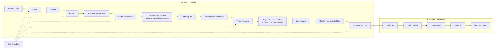
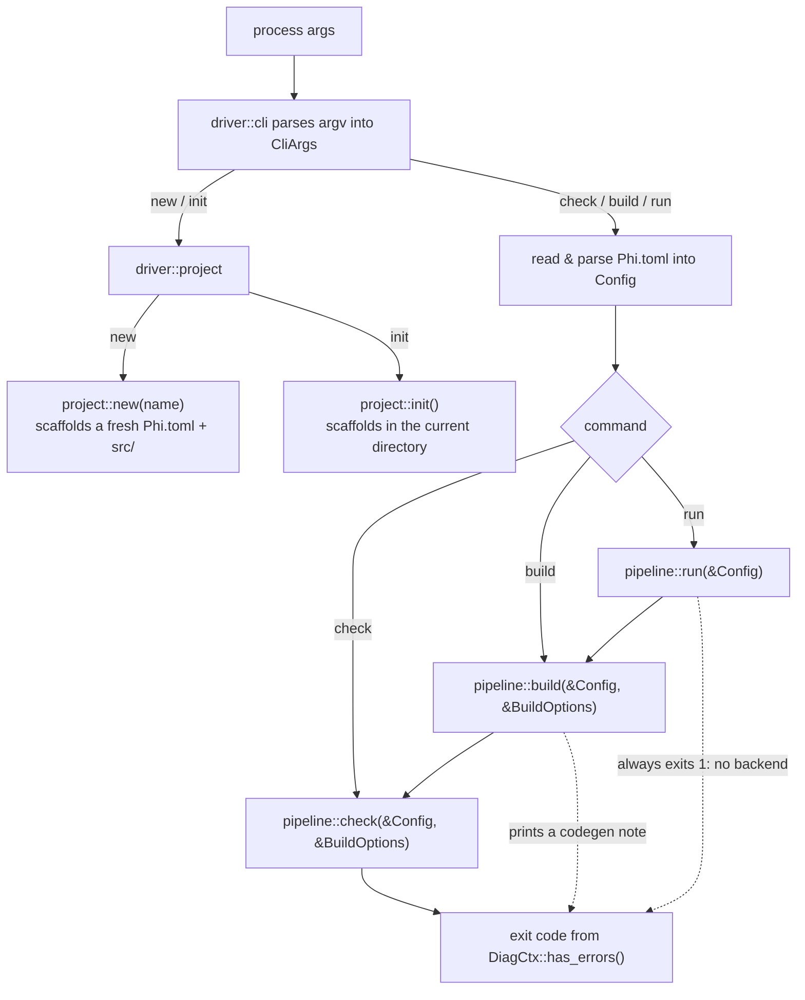
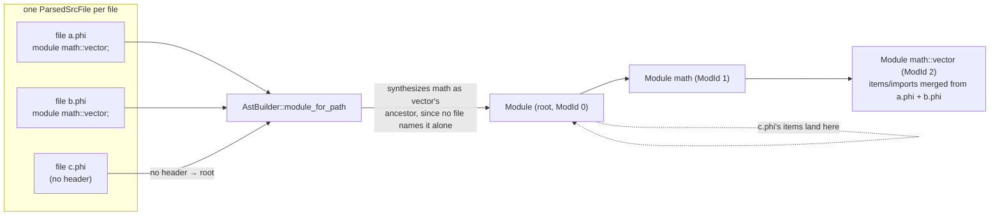
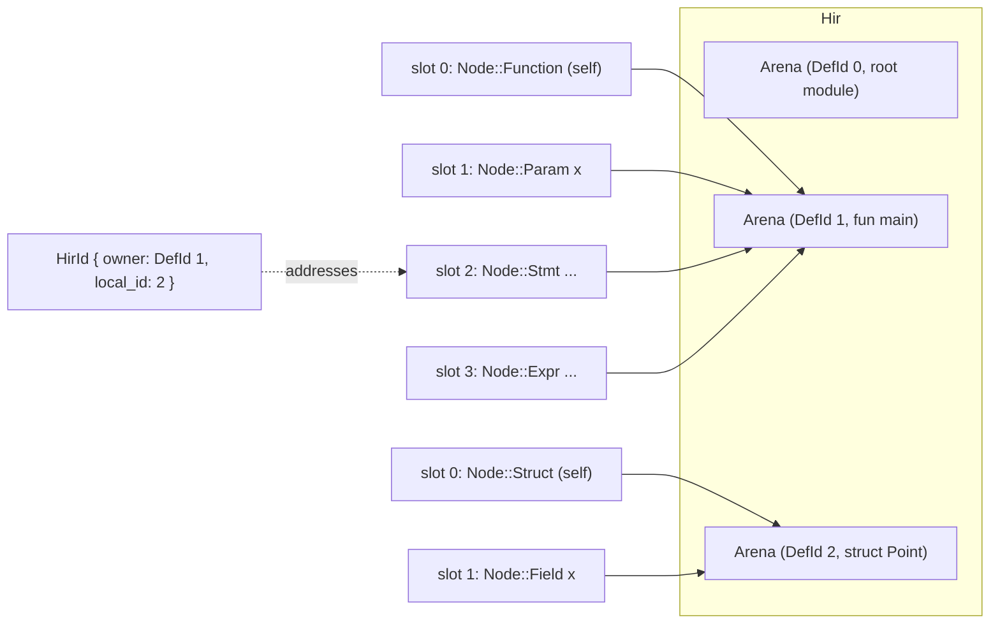
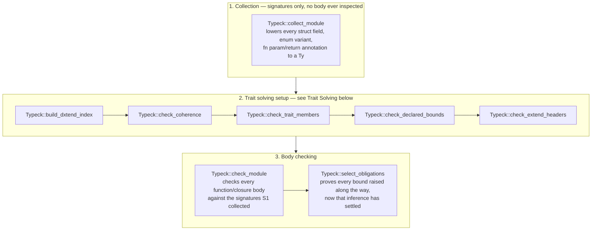
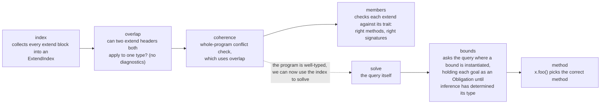

# Compiler Architecture
Broadly, the compiler's architecture can be described as such, which is similar to `rustc`: 


In the future, there are plans to move to incremental compilation, as well as to parallelize the lexer, parser, and codegen.

## Driver and CLI
Phi supports the following CLI:
```
phi build --ast --hir --mir --llvm --emit-debug --no-emit-core
phi check --ast --hir --mir --llvm --emit-debug --no-emit-core
phi run
phi new project-name
phi init
phi --help
```

Every project is described by a `Phi.toml` manifest at its root, with sources collected only
from that project's `src/` directory. The manifest has a required `[project]` table with
`name`, `version`, and `edition`, and an optional `[profile]` table with `mode = "debug" |
"release"`, defaulting to `debug` when the table (or the key) is absent.

```toml
[project]
name = "example"
version = "0.1.0"
edition = "2026"

[profile]
mode = "debug"
```

The overall driver architecture is the following:
```
driver/
├── cli.rs                 # CLI and Phi.toml parsing, and dispatch
├── source.rs              # SrcSpan, SrcFile, SrcMap, SrcCollector
├── project.rs             # Project creation: `phi new` and `phi init`
├── pipeline.rs            # The compiler stages (lexer -> parser -> ...)
└── emit_debug.rs          # Human-readable dumps of each stage's output
```

The CLI and Phi.toml parsing are implemented by the `driver::cli` module. The code inside `driver::cli` collects the args given into two constructs:
1. `CliArgs`, an enum which contains all possible commands and tracks what options were given for the current command.
2. `Config`, a struct read from the project's `Phi.toml`, holding project name/version/edition, the compilation mode (release/debug), and the project's root and `src/` directories.
Based on what args are given, `driver::cli` either dispatches to the `driver::project` module, which handles project creation, or to the `driver::pipeline` module, which handles the actual compilation.



The public API in `driver::project` and `driver::pipeline` mirrors the CLI. In `project.rs`, there is `pub fn init()` and `pub fn new(project_name: &str)`, which mirror the two commands in the CLI with the same name. In `pipeline.rs`, there is `pub fn check(config: &Config, options: &BuildOptions)`, `pub fn build(config: &Config, options: &BuildOptions)`, and `pub fn run(config: &Config)`. `Config` represents the manifest, which contains information about the project. Meanwhile, `BuildOptions` carries the flags the invocation of `build` or `check`.

`build` and `check` accept the same flags and differ only in that `build` additionally prints a note that code generation is not implemented yet and that `build` currently only checks; `run` builds first, then reports that there is no backend to run and exits with status 1. `--mir` and `--llvm` are both accepted by `build` and `check`, but since neither stage exists yet, passing either just prints a note that the stage is not implemented and has no other effect. `--emit-debug` dumps every stage that is actually implemented, which includes the `NameResolutions` and `TypeResolutions` dumps even though those have no flag of their own to request them individually; `--no-emit-core` never affects compilation itself, only whether the core library's definitions show up in those dumps.

The remaining module, `driver::source`, contains `SrcSpan`, `SrcFile`, `SrcMap`, and `SrcCollector`, which are used to track source files and source file contents, and to collect them from the project's `src/` directory.

`SrcSpan` represents a half-open span of character offsets in the source code. It is a pure data class and does essentially nothing else but hold these two indices. These offsets are global across all source files which removes the requirement to store a pointer/reference to the file inside `SrcSpan`. Meanwhile, `SrcFile` tracks the contents of a single file and some metadata about it. This is essentially the structure of `SrcFile`.

```rust
pub struct SrcFile {
    pub name: String,
    pub content: Vec<char>,
    /// Whether the file is a part of lib/core (which holds implementations of the core of the stl) or a user file
    pub origin: FileOrigin,
    /// The offset of this file's first char within the whole `SrcMap`'s global address space.
    pub global_offset: usize,
    /// The global offset at which each line of this file starts.
    pub line_starts: Vec<usize>,
}
```

Meanwhile, `SrcMap` keeps track of all `SrcFile`s in the project and allows us to query some information about the contents of each file. See the code implementation for what queries we can make. Files are added into `SrcMap` through the `SrcCollector` class which walks through the current repository searching for `.phi` files. 

## Lexer
The first stage in the pipeline is lexing, which converts the raw text of a `SrcFile` into `Token`s. The `Lexer` works on UTF-8 source code, which is decoded into chars. The structure of the `lexer` module is the following:
```
src/
├── lexer.rs                 # Handles CLI parsing (clap/structopt)
└── lexer/
    └── token.rs            # The actual compiler stages (lexer -> parser -> ...)
```
`token.rs` holds the `Token` struct which comprises of two things: a `TokenKind` enum storing the type of token it is and a `SrcSpan` storing the token's location.

```rust
pub struct Token {
    pub kind: TokenKind,
    pub span: SrcSpan,
}
```

`lexer.rs` holds the actual implementation for the `Lexer`. The `Lexer` is a lightweight struct which operates over reference to the contents of a file. It exposes two functions as a part of its public-facing interface: `new` (which creates a new `Lexer` for a file) and `tokenize` (which lexes the file to produce a `Token` stream). Since one instance of `Lexer` only operates for one file, a new instance must be created for each file.

```rust
pub struct Lexer<'a> {
    /// [`Lexer::src`] is a &Vec<char> represent the raw source code.
    src: &'a Vec<char>,

    /// [`Lexer::file_offset`] allows the [`Lexer`] to produce global
    /// [`SrcSpan`]s for the [`Token`] stream it outputs.
    file_offset: usize,

    /// [`Lexer::cursor`] is the current position in [`Lexer::src`].
    cursor: usize,

    /// [`Lexer::lexeme_pos`] is position that the current lexeme (lexical unit)
    /// starts at in [`Lexer::src`].
    /// This is required for generating spans for multi-character tokens as
    /// [`Lexer::cursor`] is not the start of the token anymore.
    lexeme_pos: usize,
}

/// Public facing methods
pub fn new(src_text: &'a Vec<char>, file_offset: usize) -> Lexer<'a>;
pub fn tokenize(&mut self) -> Vec<Token>;
```

## Parser
The Phi parser is implemented with the `chumsky` parser combinator library. `Parser` is a lightweight struct. It stores nothing about the file which is being parsed. To parse a file, `Parser` exposes the following method:

```rust
pub fn parse(&self, tokens: &[Token], file_offset: usize) -> ParsedSrcFile;
```

Since Phi's semantics allow a module to be implemented across several files, we cannot return an AST from just one file. Instead, the `parse` functions returns a `ParsedSrcFile`, which must be combined based on what module each implements to create the Abstract Syntax Tree (AST). The `Parser` has just the function for this, which parses all token streams into the AST:
```rust
pub fn parse_all(&self, streams: &[(Vec<Token>, usize)]) -> Ast {
```

The structure of the parser module and its submodules is as follows:
```src/
└── parser.rs
    ├── block_parser.rs
    ├── expr_parser.rs
    ├── item_parser.rs
    ├── pattern_parser.rs
    └── type_parser.rs
```
Each submodule produces a specific sub-grammar for group of language features. There is a sub-grammar for blocks/statements, for expressions, for patterns, etc. which can be used. However, this is slightly misleading as to what goes on under the hood. Since sub-grammars recurse into each other, the  library requires that we define "monolithic" grammars which is responsible for parsing all recursing sub-grammars. For example, types and expressions recurse into each other, requiring a single grammar for all expressions and types. We thus separate these grammars for a cleaner public-facing interface.

## Abstract Syntax Tree (AST)
The Abstract Syntax Tree is a tree representing the written program. The goal of the AST is convert the user's exact syntax into a tree form for semantic analysis. Nodes in the AST are heap-allocated, unlike the HIR later on. However, despite not being arena-allocated, nodes in the AST are still allocated a `NodeId` for identification during name resolution. To facilitate lookup using `NodeId`, there are plans to arena-allocate the AST in a similar fashion to the HIR. We note that this is current a low-priority refactor.

### Items
An `Item` represents any top-level declaration or statement. The following describes exactly what an `Item` can be.
```rust
#[derive(Clone, Debug)]
pub struct Item {
    pub kind: ItemKind,
    pub span: SrcSpan,
}

#[derive(Clone, Debug)]
pub enum ItemKind {
    ModuleDecl(ModuleDecl),
    Import(Import),
    Function(Function),
    Struct(Struct),
    Enum(Enum),
    Trait(Trait),
    Extend(Extend),
    Error,
}
```
An important thing to note is that `ModuleDecl` only represents the module declaration at the top of a file, such as `module math::vector`. That is, it just stores information not what module this file is implementing, **not** the contents of that module. This is due to Phi semantics allowing modules to implement any separate module. When the AST is created, code is organized into `Module`s, which actually hold information about the `Items` and imports in a module. Note that due the fact that modules must be assembled after parsing, `Module::items` does NOT contain child modules, since a `Module` is not a variant of `ItemKind`. You must use `Module::children` to iterate through child modules.

`Parser::parse` (and `parse_all`) each produce one `ParsedSrcFile` per file, which describes a file's own `module` header, its imports, and its items. `Ast::new` then turns a `Vec<ParsedSrcFile>` into the module tree, via a private `AstBuilder`:



### Types
To separate related work into distinct stages of the pipeline when possible, `ast::Ty` deliberately does not distinguish between primitives and nominal types to prevent name resolution from being done during parsing. Thus, there is one representation with `TyKind::Path`.

```rust
#[derive(Clone, Debug)]
pub struct Ty {
    pub kind: TyKind,
    pub span: SrcSpan,
}

#[derive(Clone, Debug)]
pub enum TyKind {
    Path {
        path: Path,
        args: Vec<Ty>,
    },
    Ref {
        base: Box<Ty>,
        mutability: Mutability,
    },
    /// `any T`, which can only be used as a parameter or return type.
    Any(Box<Ty>),
    Tuple(Vec<Ty>),
    Array {
        elem: Box<Ty>,
        len: Option<Box<Expr>>,
    },
    Function {
        params: Vec<Ty>,
        ret: Option<Box<Ty>>,
    },
    Dyn {
        path: Path,
        args: Vec<Ty>,
    },
    Error,
}
```

## Name Resolution
Name Resolution operates on the AST to produce a side table mapping `Path`s in the AST to references to Nodes in the AST. Since paths cannot uniquely identify variables (such as in the case of variable shadowing), we identify using each node's `NodeId` and append a list of two-tuples where the first element is a Path owned by the node and the second element is what that Path names.

```rust
pub struct NameResolutions {
    paths: HashMap<NodeId, SmallVec<[(Path, Res); 2]>>,
    lang_items: AstLangItems,
}
```

Here, `Res` is an enum which represents the various categories of nodes which a `Path` can refer to:
```rust
pub enum Res {
    Type(Type),
    Local(Local),
    Function(NodeId),
    Module(NodeId),
    Err,
}

#[derive(Clone, Copy, Debug, PartialEq, Eq)]
pub enum Type {
    Prim(PrimTy),
    Generic(NodeId),
    Def(TyDef),
}

#[derive(Clone, Copy, Debug, PartialEq, Eq)]
pub enum TyDef {
    Struct(NodeId),
    Enum(NodeId),
    Trait(NodeId),
}

#[derive(Clone, Copy, Debug, PartialEq, Eq)]
pub enum Local {
    Param(NodeId),
    SelfParam(NodeId),
    Variable(NodeId),
}
```
As you can see above, a `Path` can refer to a type, which can be a primitive type, a generic like `T` or a definition, such as a struct, enum, or trait. It can also refer to functions and locals, which can be parameters, local variables, and so on. The separation of all of these inside `Res` allows future passes to assert that a Path which can only reference one specific category of language constructs does not erroneously reference another category. For example, we can assert that the `Res` for a function's return type indeed references a type, rather than somehow referring to a module or other function. 

The `SymbolTable` holds all names which are currently in scope and allows for the lookup and insertion of names. To facilitate more ergonomic naming, it holds multiple parallel scopes of names depending upon the type of language construct. For example, different scopes exist for local variables, functions, and types, allowing the programming to use the same name for a local variable and a function.

```rust
pub struct SymbolTable<'ast> {
    local_scopes: Vec<HashMap<Symbol, Local>>,
    generic_scopes: Vec<HashMap<Symbol, Type>>,
    self_scopes: Vec<Option<TyDef>>,

    modules: HashMap<NodeId, ModuleScope>,
    items: HashMap<NodeId, &'ast Item>,

    prelude: Option<NodeId>,
    ast: &'ast Ast,
}

struct ModuleScope {
    functions: HashMap<Symbol, NodeId>,
    types: HashMap<Symbol, TyDef>,
    mods: HashMap<Symbol, NodeId>,
}
```

Primarily, the `SymbolTable` provides two functionalities, lookup and insertion. While insertion is done automatically when the `SymbolTable` is built from a reference to the AST (this is true except for locals, which need to be inserted manually), lookup must be done manually when encountering an unknown `Path`. The `SymbolTable` reveals these methods, which are commonly used:

```rust
pub fn lookup_value_path(&self, from: NodeId, path: &Path) -> Option<Res> // handles functions and locals
pub fn lookup_type_path(&self, from: NodeId, path: &Path) -> Option<Type> // handles all types
pub fn lookup_dyn_path(&self, from: NodeId, path: &Path) -> Res  // We special case this since the type for a `dyn T` must be a Trait
pub fn lookup_mod_path(&self, from: NodeId, path: &Path) -> Option<NodeId> // handles modules
```
Here, `from` represents the `NodeId` of the module where we are searching from. There are also trivial variants which do not have the functionality of looking up a `Path` and instead work with `Symbol`s.

For dealing with resolution of bodies, `SymbolTable` exposes these methods:
```rust
pub fn push_scope(&mut self)
pub fn pop_scope(&mut self)
pub fn insert_local(&mut self, name: Ident, local: Local)
pub fn lookup_local(&self, name: Symbol) -> Option<Local>
```
Note that while `lookup_value_path` also handles the same case as `lookup_local`, `lookup_local` can be useful when you know that the value you are looking up must resolve to a local.

For resolving generics and `self`, `SymbolTable` has the following:
```rust
pub fn push_generics(&mut self, params: HashMap<Symbol, Type>)
pub fn pop_generics(&mut self)
pub fn lookup_generic(&self, name: Symbol) -> Option<Type>

//-------------------------------------------------------------------------
pub fn push_self(&mut self, ty: TyDef) 

/// This is used for cases where due to a program error, a Self does not exist.
/// For example, an `extend`  block whose `adt_path` didn't find anything.
pub fn push_self_unresolved(&mut self)

pub fn pop_self(&mut self)

/// Returns the type that `Self` currently refers to and None if it doesn't exist
pub fn current_self(&self) -> Option<TyDef>

/// This allows us to tell whether this is no Self because we are in a context where Self doesn't exist or because there is an error
pub fn current_self_entry(&self) -> Option<Option<TyDef>>
```

The actual name resolution phase runs in several phases: 
1. A collection phase adds all items such as functions, modules, and types into `ModuleScope`s
2. An import phase resolves all imports, reporting errors for conflicting glob imports, importing private items, etc.
3. The prelude, which contains `LangItem`s (a collection of traits and types which are fundamental to Phi) is collected
4. A resolution phase resolves references found in bodies (such as the bodies of functions).

## Lowering #1 (AST -> HIR)
Before you read this section, it could possibly be more useful to read the section detailing the HIR below, primarily to gain an understanding of the HIR first. 

Broadly, the first lowering pass works in 2 distinct passes:
1. Every `definition` first get assigned its `DefId`. Note that `DefId`s for `definitions` are assigned in an order such that a child gets assigned  its `DefId` after its parent. This is important since the HIR constructs a parent graph.
3. Arenas are built and filled for each `definition`.

The goal of the lowering pass is not only to create the HIR (obviously), but to also assign results from name resolution to each respective node and to desugar the language so that future analysis patterns can be simplified.

### LoweringCtx
`LoweringCtx` is a struct which keeps track of the current state of the lowering pass. It contains information such as:
1. What is the next `DefId` which can be assigned (`DefIdAllocator`)
2. What is the `DefId` of the `definition` with this `NodeId`
3. What is the `HirId` of the node with this `NodeId`
4. What is the arena of this `definition`
5. What are the current name resolution results

```rust
pub(super) struct LoweringCtx<'res> {
    pub(super) def_id_allocator: DefIdAllocator,
    pub(super) def_ids: HashMap<NodeId, DefId>,
    pub(super) hir_ids: HashMap<NodeId, HirId>,
    // This exists since Functions do not have their own NodeId (only Item does)
    // This may likely change in an upcoming refactor so this doc comment
    // may be updated soon.
    pub(super) method_defs: HashMap<NodeId, Vec<DefId>>,
    pub(super) arenas: HashMap<DefId, Arena>,
    nameres: &'res NameResolutions,
}
```
The `LoweringCtx` is also responsible for consuming this state to produce the final HIR through `LoweringCtx::finish`.

To actually accomplish the 2 pass lowering process, `LoweringCtx` exposes several methods: `prealloc_item` and `lower_*` methods. `prealloc_item` is responsible for the first pass, which assigns `DefId` to all `definitions` other than modules. It should be noted that since `ItemKind` does not include modules, the logic for modules is handled separately in the same approximate location in the source code. The `lower_*` methods contain the lowering code for each construct. For example, `lower_module` contains the logic for lowering modules and `lower_pat` contains the logic for lowering patterns. 

Because of the structure of arenas in HIR, we also have a few other classes to help us. `ArenaBuilder` is a lower-abstraction interface for building arenas. It has 3 important public-facing methods:
1. ```pub fn reserve(&mut self) -> HirId``` reserves the next `LocalId` in this arena. This must be called before lowering a node's children.
2. ```pub fn fill(&mut self, id: HirId, node: impl Into<Node>)``` writes into the slot reserved by `reserve`.
3. ```pub fn finish(self) -> Arena``` consumes the state of the `ArenaBuilder` to create the Arena.

To make lowering `definitions` easier, which is the main use of `ArenaBuilder`, there is also `OwnerLowerer`, which is a thin wrapper around `ArenaBuilder`. Mostly importantly, it provides helpers (`synth_*`) for lowering expressions, statements, patterns and more which ensure that the low-level abstractions for `ArenaBuilder` are used properly (that is, `reserve` is called before `fill`). Let's examine `synth_expr`, which is the corresponding helper for expressions:

```rust
pub(super) fn synth_expr(
    &mut self,
    span: SrcSpan,
     build: impl FnOnce(&mut Self, HirId) -> crate::hir::ExprKind,
) -> HirId {
    let hir_id = self.reserve();
    let kind = build(self, hir_id);
    self.fill(hir_id, Node::Expr(Expr { hir_id, kind, span }));
    hir_id
}
```

Here, `build` is a function which essentially allows us to construct an `hir::ExprKind` from some kind of information. `synth_expr` also ensures that `reserve` is called before `fill`, helping us write bug-free code.

### Desugaring 
See the section on HIR to see what is desugared. 

## High Intermediate Representation (HIR)
The High Intermediate Representation (HIR) is an Intermediate Representation used for type inference. It is built using the AST from the `Parser` and results from `NameResolution`. The HIR has a few differences from the AST:
1. Unlike the AST, where nodes are individually heap-allocated, nodes in the HIR are arena-allocated
2. Nodes in the HIR are organized with a two-level ID system, like that of the Rust compiler
3. Instead of being split between statements, expressions, and items, the HIR is more broadly split between `definitions` and `locals`. Below, we go into more detail about arena-allocation, the two-level ID system, and `definitions` and `locals`.
4. Paths inside the HIR contain a reference to the `definition` or `local` they name.

`definitions` are any node which can "own" some other value. For example, a function is a `definition` because it can "own" parameters and the statements in its body. Phi defines the following language constructs as `definitions`: Functions, Structs, Enums, Traits, Extend Blocks, Modules, and Closures. All other constructs, such as struct fields, statements, expressions, patterns, etc. are considered `locals`. Being a `definition` enables the node to own an arena, which holds all the `locals` the `definition` owns. Arenas are formatted in the following manner: the first slot holds the owner of the arena (the `definition`) while all slots after hold `locals` the definition owns. For example, a function's arena holds itself in the first slot with its parameters and any statements in its body after. Each `definition` is also assigned an unique `DefId`, which can be used to access its arena. It should be noted that `definitions` are **not** stored into arenas. For example, a module holds `definitions` but these are not stored in the module's arenas, but inside their own arenas. They are stored at the same level as their parent module in the HIR:

```rust
pub struct Hir {
    /// Maps each definition, indexed by its [`DefId`], to the [`Arena`] holding its
    /// nodes.
    arenas: Vec<Arena>,
    ... the rest of the code is hidden
}
```

To fully identify `locals` and allow for incremental compilation, nodes in the HIR are tracked with a two-level ID called `HirId`. A `HirId` holds both a `DefId` (to keep track of the arena where the node is located) and a `LocalId` (to keep track of the exact slot in the arena). 

```rust
pub struct HirId {
    pub owner: DefId,
    pub local_id: LocalId,
}
```

To have more uniform call sites and avoid multiple functions accepting either `DefId` or `HirId`, `definitions` are also assigned a `HirId` where `local_id` is 0 (remember that definitions are stored at the first slot: slot 0).



Every arena's slot 0 holds the definition that owns it (so a `DefId`'s own `HirId` is always `{ owner: that DefId, local_id: 0 }`), and every later slot holds one of its locals, such as parameters, statements, expressions, patterns. 

### Desugaring
Desugaring allows Type Inference to consider fewer expression kinds than the AST. We desugar `while`, `for`, and `while let` to one `ExprKind::Loop`, and `if let`  to
`ExprKind::Match`.

## Type Inference
Type checking runs in three stages over the whole program, collection, trait solving, and checking. Collection considers the annotated signatures of functions, structs, enums, etc. to gather type information which can be used later on. Trait solving can be viewed as an extension of collection, where we gather information about which types conform to which traits. Lastly, we use all the information above to check the bodies of Nodes.



### Type Representation
To allow for unification of all instances of a type, the type checking stage uses its own representation of a type in the Phi Programming Language. Instead of storing types as values in previous stages, a `TyKind`, which represents a unique type, is interned in a `TyCtx` (type context. Users instead are given references (represented by `Ty`, which can be thought of as a pointer to `TyKind`) to a canonical instance of `TyKind`. It should be noted that there is only one unique `Ty` for every `TyKind`. That is, every `Ty` which refers to the same `TyKind` is equal. This allows quick comparison for type equality. Since `Ty` also functions essentially as a pointer to `TyKind`, `Ty` can also be quickly copied and distributed, unlike `TyKind` which must be duplicated deeply (since types can nest).

```rust
pub struct Ty(u32);

#[derive(Clone, Copy, PartialEq, Eq, Hash, Debug)]
pub enum TyVar {
    Any(u32),
    Int(u32),
    Float(u32),
}

#[derive(Clone, PartialEq, Eq, Hash, Debug)]
pub enum TyKind {
    Var(TyVar),
    Primitive(PrimTy),
    Adt {
        def: DefId,
        args: Vec<Ty>,
    },
    Generic(HirId),
    SelfTy(DefId),
    Ref {
        base: Ty,
        mutability: Mutability,
    },
    Any(Ty),
    Unit,
    Tuple(Vec<Ty>),
    Array {
        elem: Ty,
        len: Option<HirId>, // -> Node::Expr, the constant expression `N`
    },
    Fun {
        params: Vec<Ty>,
        ret: Option<Ty>,
    },
    Dyn {
        trait_: DefId,
        args: Vec<Ty>,
    },
    Never,
    Error,
}
```
Note that for type inference, we also have a variant for inference variables, which are placeholders for the types of expressions which do not yet know the type of. Inference variables are also further classified by their constraints. `TyVar::Any` represents a inference variable which can be any type. That is, we don't know anything about what type it could be and thus we could unify with (say it is) any type. `TyVar::Int` represents an inference variable which we know has to be an integer. This is mainly used for integer literals, which can be coerced into an integer of any width, but not any other type. Note that integers are defaulted to `i32` if there is no restriction on their width. `TyVar::Float` is the equivalent for floats. In Phi, floats are defaulted to `f64`.

### Unification
Unification works through a Disjoint Set Union (DSU, also please see related literature on that data structure). Essentially, we treat unique types as nodes (which is why we use the type representation above). Types which are "equivalent" are connected with an edge bidirectionally such that all types equivalent to each form connected components. Thus, we can easily and quickly query and add connectivity (whether something is the same type) using a DSU. 

`Unifier`, the DSU implementation, exposes two public-facing methods, `root` and `unify`. These are the equivalent of the similar named functions in a standard DSU implement for graph connectivity. 

```rust
pub fn root(&mut self, ty: Ty) -> Ty {
```
`root` returns the representative of `ty`'s connected component. Note that we have explicitly design unification such that root will return a concrete type (a type that is not an inference variable) in the case that we know the type of an inference variable. For example, say you unified an inference variable and `i32`. If you call `root` on that inference variable, you will get back `i32`. This is accomplished by preferring concrete types to be the representatives of connected components over inference variables.

```rust
pub fn unify(&mut self, tcx: &TyCtx, expected: Ty, found: Ty) -> Result<(), UnifyError> {
```
Meanwhile, `unify` connects two types `expected` and `found`, returning a Result where success is the Unit type and `UnifyError` is the error type. If unification fails, the function is a no-op. `UnifyError` has the following variants describing why unification failed:

```rust
pub enum UnifyError {
    Mismatch { expected: Ty, found: Ty },  // mismatch between two incompatible types (like String and i32)
    ExpectedInteger { var: Ty, found: Ty }, // mismatch between an inference variable known to be an integer and some type that is not an integer or a var known to be an integer
    ExpectedFloat { var: Ty, found: Ty }, // same as above but for inference variables known to be a float
    Infinite { var: Ty, ty: Ty }, // unification which would cause an infinite type (just search this up for an explanation :-) ) 
}
```

### `TyCtx`
`TyCtx` stores the context of the type checking pass, such the next variable counter, every unique type, and more. It is analogous to the *environment* in type inference literature.
```rust
pub struct TyCtx {
    tykinds: Vec<TyKind>,
    handles: HashMap<TyKind, Ty>,
    /// Type variable counter
    next_var: u32,
}
```

It exposes several public methods (`mk_*`) for creating types based on their content:

```rust
pub fn mk_prim(&mut self, prim: PrimTy) -> Ty;
pub fn mk_adt(&mut self, def: DefId, args: Vec<Ty>) -> Ty;
pub fn mk_generic(&mut self, param: HirId) -> Ty;
pub fn mk_ref(&mut self, base: Ty, mutability: Mutability) -> Ty;
pub fn mk_any(&mut self, base: Ty) -> Ty;
pub fn mk_tuple(&mut self, elems: Vec<Ty>) -> Ty;
```
Note that there are several more and that the ones selected above do not reflect all the methods which exist.

### Type Resolutions
Since field accesses and method calls cannot be resolved until after the type of the receiver is known, `TypeResolution` not only keeps track of the type of each node in the HIR, it also keeps track of the resolutions of method calls and field accesses. 

```rust
pub struct ResolvedCall {
    pub def: DefId,
    pub args: Vec<Ty>,
}

pub struct TypeResolutions {
    ty: HashMap<HirId, Ty>,
    calls: HashMap<HirId, ResolvedCall>,
}

impl TypeResolutions {
    pub fn new() -> TypeResolutions;
    pub fn record(&mut self, id: HirId, ty: Ty);
    pub fn record_def(&mut self, def: DefId, ty: Ty);
    pub fn ty(&self, id: HirId) -> Option<Ty>;
    pub fn ty_of_def(&self, def: DefId) -> Option<Ty>;
    pub fn tys_iter(&self) -> impl Iterator<Item = (HirId, Ty)> + '_;
    pub fn record_call(&mut self, id: HirId, def: DefId, args: Vec<Ty>)
    pub fn call(&self, id: HirId) -> Option<&ResolvedCall>
    pub fn calls_iter(&self) -> impl Iterator<Item = (HirId, &ResolvedCall)> + '_
}
```

### Trait Solving
When we see a call to a method defined by a trait, a bound on a generic (`T: Default`), or a binary operator, we would like to ask the central question: "does this type implement this trait?". Trait solving allows us to answer this question. Below is a diagram outlining the structure of `typeck::traits` with the responsibility of each module.



### Index
The first stage of trait solving involves building an index of every extend block in the program. For each type (which are only structs and enums for now), we accumulate all extend blocks for that type. It should be noted that we accumulate extend blocks whether they are inherent (`extend T`) or whether they extend a type with a trait (`extend T with U`). This index allows us to query later on whether a type implements a trait or check whether the program is well-typed (no extend blocks conflict with each other).

## Coherence
After we build the index, we must check whether the program is well-typed or coherent before we use the index to answer any questions. There are several checks we must perform to assure that the program is coherent. The first check is whether there are any overlaps or conflicts between two extend headers. Suppose we have a type `Foo<T>` and a trait `Bar`. The program consisting of `extend<T> Foo<T> with Bar` and `extend Foo<i32> with Bar` is not coherent, as we don't know whether to use the method implementation inside the first extend block or the second extend block. Basically, it is ambiguous on what implementation to use. However, the program consisting of `extend Foo<bool> with Bar` and `extend Foo<i32> with Bar` is unambiguous and well-typed, as `bool` and `i32` are distinct from each other. This logic is found inside `trait::overlap`, where we compare two extend headers and check whether they overlap or not. Because generics can be any type, this actually works similarly to type unification! We can treat a generic inside a header as an inference variable and perform unification to check whether two headers overlap, similarly to checking whether two types can unify! Note that we also need to make sure that there are no methods with duplicated names. The next check is whether the definitions of methods inside extend blocks match up with those in the trait definitions. We must check that the signatures match and whether the right methods are implemented. 

## Solving
We represent the central question of trait solving with the `Query` struct:
```rust
// This represents a query: here, we are asking, does `type_` implement
// `trait_`?
#[derive(Clone, PartialEq, Eq, Debug)]
pub struct Query {
    pub type_: Ty,
    pub trait_: TraitRef,
}
```

The solution to a query is represented as such:
```rust
/// The answer to a query.
#[derive(Clone, Copy, PartialEq, Eq, Debug)]
pub enum Solution {
    Holds, /// Query::type_ does implement Query::trait_
    DoesNotHold, /// Query::type_ does NOT implement Query::trait_
    /// The query still contains inference variables, so it can be neither proved nor disproved
    /// yet. Ask again once more of the body has been checked.
    Ambiguous,
    /// The goal contained [`TyKind::Error`]. A diagnostic for this already exists
    Error,
}
```
Note the presence of the `Ambiguous` variant; we note that it is not always immediately possible to solve a query due to some types still being inference variables at the time we first build the `Query`. For example, suppose we have the following program:
```phi
fun make<T: Show>() -> T {
    return make();
}

fun f(a: Foo) {
    let mut b = make();
    b = a;
}
```
Here, it is not immediately obvious what the types are after we create `b`. We know that `b` must be some type that implements `Show` but it is not until the next line that we know the exact type of `b` (`Foo`) and we can answer the query by asking whether `Foo` extends with `Show`.

The main public interface to answer `Query` is `implements`, which takes a `Query` and all bounds current in scope (which we call the environment) to answer the `Query`:
```rust
pub fn implements(&mut self, query: &Query, env: &BoundsEnv) -> Solution {
```

In `BoundsEnv`, we reuse the `Query` class to represent trait bounds which are assumptions which have been declared in the current scope through trait bounds.
```rust
/// These represent the trait bounds which are present in the current scope.
#[derive(Clone, Debug, Default)]
pub struct BoundsEnv {
    pub bounds: Vec<Query>,
}
```
In `implements`, we have several checks. 
1. We try to resolve every inference variable in query. If we cannot fully resolve every inference variable, then we report that the query is ambiguous.
2. If there are any `TyKind::Error` in the types of the query, we propagate `Solution::Error`.
3. Next, we check for solutions for the case of where `query.type_` is a generic by checking the environment for any declarations which state that `query.type_` implements `query.trait_`.
4. If the query's type is `dyn T<args...>`, then we simply check whether the trait in the query is the trait in the query's type and whether the generic type arguments match up
5. Currently, we cannot use traits with anything other than structs or enums so we check whether the query's type is one of those
6. Now, we can search through the index to find an extend block which "proves" that this query is valid.
7. Lastly, we must check whether the assumptions we proved the query on hold. We thus iterate through our bounds and then use implement on them.

However, due to the fact that solutions can not be determined immediately, implements is difficult to work with. Thus, an `Obligation` represents a query which must hold along with `SrcSpan`s which are provided for the purposes of diagnostics. 
```rust
pub struct Obligation {
    /// The bound to prove, for example `Bare: Show`.
    pub query: Query,
    /// Where the instantiation that raised this obligation was written.
    pub cause: SrcSpan,
    /// Where the bound itself was declared, e.g. on `Sorted`'s own `<T: Show>`.
    pub declared_at: SrcSpan,
}
```
At the end of type checking, we iterate through these Obligations and attempt to solve them, now that we have (hopefully) resolved all inference variables.

## Mid Intermediate Representation
The Mid Intermediate Representation (MIR) is based on a Control Flow Graph (CFG) representation. In the MIR, the atomic representation of code is through a `BasicBlockData`. One `BasicBlockData` holds code in the form of statements and a `terminator` which describes how the block ends, such as by calling another function, branching to another block, etc.:
```rust
pub struct BasicBlockData {
    pub statements: Vec<Statement>,
    pub terminator: Terminator,
}
```

A `Mir::Statement` consists of its kind and its span. Its kind can consist of the following:
```rust
#[derive(Clone, Debug)]
pub struct Statement {
    pub kind: StatementKind,
    pub span: SrcSpan,
}

#[derive(Clone, Debug)]
pub enum StatementKind {
    /// Begins the "lifetime" of a variable
    StorageLive(Local),
    /// Ends the "lifetime" of a variable
    StorageDead(Local),
    /// Assignment of an rvalue into a place/lvalue
    Assign(Place, Rvalue),
    /// Sets the discriminant of an enum
    SetDiscriminant {
        place: Place,
        variant: VariantIdx,
    },
    /// `PlaceMention` represents a call where the end result is discarded. This is mainly used to preserve side-effects
    PlaceMention(Place),
    /// This checks that `place` can be written to at this point in the program.
    CheckMutable(Place),
}
```

As we mentioned before, a `Terminator` represents how a block can "transfer" control to another block.

```rust
#[derive(Clone, Debug)]
pub struct Terminator {
    pub kind: TerminatorKind,
    pub span: SrcSpan,
}

#[derive(Clone, Debug)]
pub enum TerminatorKind {
    Goto {
        target: BasicBlock,
    },
    Return,
    /// Switch statement
    SwitchInt {
        discr: Operand,
        targets: SwitchTargets,
    },
    Call {
        func: Operand,
        args: Vec<Operand>,
        destination: Place,
        /// This is `None` for a call whose return type is `Never`. For example, the runtime
        /// panic function never returns control to its caller, so a call to it has no
        /// continuation block to target.
        target: Option<BasicBlock>,
    },
    Drop {
        place: Place,
        target: BasicBlock,
    },
    Assert {
        cond: Operand,
        expected: bool,
        msg: AssertMessage,
        target: BasicBlock,
    },
    Unreachable,
}
```
It should be noted that basic blocks do not have fallthrough. Transitioning to another block uses the variant `Goto`.

To represent a definition which contains run-able code, the MIR has `Body`. It should be noted that structs, enums, traits, and modules have no `Body` since they have no run-able code.
```rust
#[derive(Debug)]
pub struct Body {
    /// DefId of the definition this block is for
    pub def_id: DefId,
    pub basic_blocks: Vec<BasicBlockData>,
    pub local_decls: Vec<LocalDecl>,
    /// `param_count` is the number of `local_decls` that are parameters including `self`. Slots
    /// `1..=param_count` are the parameters in declared order, slot `0` is always the return place,
    /// and every slot after `param_count` is a `let` binding or a compiler-introduced temporary.
    pub param_count: usize,
    pub span: SrcSpan,
}
```
As the comment notes, the first slot in `local_decls` is always the return place. Slots from 1 to and including `param_count` are the parameters of the function, include `self`. After that, every slot represents a `let` or a compiler-introduced temporary.

## IDs
In the MIR, there are 3 different types of IDs used for identification. 

For locals, there is `Local`, which tracks the location of a `LocalDecl` inside a `Body`:
```rust
pub struct Local(u32);

impl Local {
    /// This is the slot every `Body` reserves for its return value.
    pub const RETURN_PLACE: Local = Local(0);
}
```

For basic blocks, there is `BasicBlock`, which tracks the location of a `BasicBlocKData` inside a `Body`:
```rust
pub struct BasicBlock(u32);

impl BasicBlock {
    /// Every `Body` begins executing at this block.
    pub const START_BLOCK: BasicBlock = BasicBlock(0);
}
```

Finally, `VariantIdx` names on variant of an enum by its position in that enum's declaration order.
```rust
pub struct VariantIdx(u32);
```

It should be noted that unlike `DefId` in the HIR, all of these ids are local to a `Body` or to an enum.

## Place

To represent a `LocalDecl`'s location in memory, the MIR has `Place`. Since memory locations can be further divided into subparts (such as fields of a struct), `Place` also consists of projections applied onto the local which helps the compiler discriminate memory subparts. See below for the types of projections. 
```rust
#[derive(Clone, PartialEq, Eq, Hash, Debug)]
pub struct Place {
    pub local: Local,
    pub projections: Vec<Projection>,
}

/// `Projection` represents one step of a [`Place`]'s projection.
#[derive(Clone, Copy, PartialEq, Eq, Hash, Debug)]
pub enum Projection {
    /// `Deref` represents `*p`
    Deref,
    /// `Field` addresses the `n`th field of a struct, tuple, tuple-variant payload, or
    /// record-variant payload.
    Field(u32),
    /// `Index` represents `a[i]`, where `i` is itself a local holding the index.
    Index(Local),
    /// `ConstantIndex` represents `a[N]` where N is a compile-time-constant
    ConstantIndex { offset: u32, from_end: bool },
    /// `Downcast` narrows an enum place to one variant's payload and is required before any
    /// `Field` projection into that payload is well-typed.
    Downcast(VariantIdx),
}
```

## RValues
Informally, a rvalue roughly corresponds to an expression in the AST or HIR. More specifically however, it is everything which can be on the RHS of an assignment. 

```rust
pub enum Rvalue {
    Use(Operand),
    /// `Ref` represents `&place` or `&mut place`.
    Ref {
        mutability: Mutability,
        place: Place,
    },
    BinaryOp(BinaryOp, Operand, Operand),
    /// `CheckedBinaryOp` behaves like `BinaryOp`, but it is only for integer `+`, `-`, and `*`. It
    /// produces a `(T, bool)` tuple, where T is the result of the operation and bool is a flag
    /// reporting whether the peration overflowed. Lowering only emits this in debug builds.
    CheckedBinaryOp(BinaryOp, Operand, Operand),
    UnaryOp(UnaryOp, Operand),
    /// `kind` distinguishes a user-written `as` from a compiler-inserted coercion for function pointers. See
    /// [`CastKind::ReifyFunPointer`].
    Cast {
        operand: Operand,
        ty: Ty,
        kind: CastKind,
    },
    Aggregate(Box<AggregateKind>, Vec<Operand>),
    /// `Discriminant` reads a place's enum discriminant as an integer, feeding a `SwitchInt`
    /// terminator.
    Discriminant(Place),
    /// `Len` reads the runtime length of an array or a slice.
    Len(Place),
}
```
In the `Use` variant, `Operand` represents a reference to a value. It consists of the following variants:
```rust
#[derive(Clone, Debug)]
pub enum Operand {
    /// This variant reads a trivially copyable place, and may occur any number of times for the
    /// same place.
    Copy(Place),
    /// This variant reads a place by consuming it.
    Move(Place),
    /// This variant is a value known at compile time, which is embedded directly into the
    /// instruction rather than read out of a local's storage.
    Constant(Constant),
}

#[derive(Clone, Debug)]
pub struct Constant {
    pub ty: Ty,
    pub kind: ConstKind,
}

#[derive(Clone, Debug)]
pub enum ConstKind {
    Int(i128),
    Float(f64),
    Bool(bool),
    Char(char),
    Str(Symbol),
    FunDef(DefId, Vec<Ty>, Option<AnyMode>),
}
```
## Instance
Since functions are monomorphized (see the section on lowering from HIR to MIR), a single `DefId` could correspond to multiple `Body`s. Here, `Instance` refers to one monomorphized instance of a definition. To fully define one instance, we need its `any` mode and its instantiations for generic type parameters:
```rust
pub struct Instance {
    pub def: DefId,
    pub any_mode: Option<AnyMode>,
    pub args: Vec<Ty>,
}
```

## Borrow Checking
