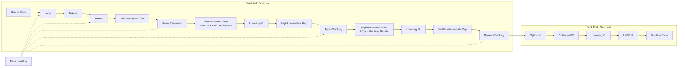

# Compiler Architecture
Broadly, the compiler's architecture can be described as such: 


In the future, there are plans to move to incremental compilation, as well as to parallelize the lexer, parser, and codegen.

## Driver and CLI
Phi supports the following CLI:
```
phi build --ast --hir --mir --llvm --emit-debug --no-emit-core
phi check --ast --hir --mir --llvm --emit-debug --no-emit-core
phi run
phi new project-name
phi init
phi --help
```

The overall driver architecture is the following:
```
driver/
├── cli.rs                 # Handles CLI parsing (clap/structopt)
├── source.rs              # FileMap, Span, reading source files
├── project.rs             # Handles "new projection creation" (like phi new)
└── pipeline.rs            # The actual compiler stages (lexer -> parser -> ...)
```

The CLI and Phi.toml parsing are implemented by the `driver::cli` module. The code inside `driver::cli` collects the args given into the two constructs:
1. `CliArgs`, an enum which contains the all possible commands and tracks what options were given for the current command.
2. `Config`, a struct which is the config given in the Phi.toml and includes things like project name/version and compilation mode (release/debug).
Based on what args are given, `driver::cli` either dispatches to the `driver::project` module, which handles project creation, or to then `driver::pipeline` module, which handles the actual compilation.

The public API in `driver::project` and `driver::pipeline` mirror the CLI. In `project.rs`, there is `pub fn init()` and `pub fn new(project_name: &str)` which mirror the two commands in the CLI with the same name. In `pipeline.rs`, there is `pub fn check(config: Config, build_options: BuildOptions)`, `pub fn build(config: Config, build_options: BuildOptions)`, and `pub fn run(config: Config, build_options: BuildOptions)`.

The remaining module contains `SrcSpan`, `SrcFile`, `SrcMap`, and `SrcCollector`, which are used to track source files and source file contents. 

`SrcSpan` represents a half-open span of character offsets in the source code. It is a pure data class and does essentially nothing else but hold these two indices. These offsets are global across all source files which removes the requirement to store a pointer/reference to the file inside `SrcSpan`. Meanwhile, `SrcFile` tracks the contents of a single file and some metadata about it. This is essentially the structure of `SrcFile`.

```rust
pub struct SrcFile {
    pub name: String,
    pub content: Vec<char>,
    /// Whether the file is a part of lib/core (which holds implementations of the core of the stl) or a user file
    pub origin: FileOrigin,
    /// The offset of this file's first char within the whole `SrcMap`'s global address space.
    pub global_offset: usize,
    /// The global offset at which each line of this file starts.
    pub line_starts: Vec<usize>,
}
```

Meanwhile, `SrcMap` keeps track of all `SrcFile`s in the project and allows us to query some information about the contents of each file. See the code implementation for what queries we can make. Files are added into `SrcMap` through the `SrcCollector` class which walks through the current repository searching for `.phi` files. 

## Lexer
The first stage in the pipeline is lexing, which converts the raw text of a `SrcFile` into `Token`s. The structure of the `lexer` module is the following:
```
src/
├── lexer.rs                 # Handles CLI parsing (clap/structopt)
└── lexer/
    └── token.rs            # The actual compiler stages (lexer -> parser -> ...)
```
`token.rs` holds the `Token` struct which comprises of two things: a `TokenKind` enum storing the type of token it is and a `SrcSpan` storing the token's location.

```rust
pub struct Token {
    pub kind: TokenKind,
    pub span: SrcSpan,
}
```

`lexer.rs` holds the actual implementation for the `Lexer`. The `Lexer` is a lightweight struct which operates over reference to the contents of a file. It exposes two functions as a part of its public-facing interface: `new` (which creates a new `Lexer` for a file) and `tokenize` (which lexes the file to produce a `Token` stream). Since one instance of `Lexer` only operates for one file, a new instance must be created for each file.

```rust
pub struct Lexer<'a> {
    /// [`Lexer::src`] is a &Vec<char> represent the raw source code.
    src: &'a Vec<char>,

    /// [`Lexer::file_offset`] allows the [`Lexer`] to produce global
    /// [`SrcSpan`]s for the [`Token`] stream it outputs.
    file_offset: usize,

    /// [`Lexer::cursor`] is the current position in [`Lexer::src`].
    cursor: usize,

    /// [`Lexer::lexeme_pos`] is position that the current lexeme (lexical unit)
    /// starts at in [`Lexer::src`].
    /// This is required for generating spans for multi-character tokens as
    /// [`Lexer::cursor`] is not the start of the token anymore.
    lexeme_pos: usize,
}

/// Public facing methods
pub fn new(src_text: &'a Vec<char>, file_offset: usize) -> Lexer<'a>;
pub fn tokenize(&mut self) -> Vec<Token>;
```
